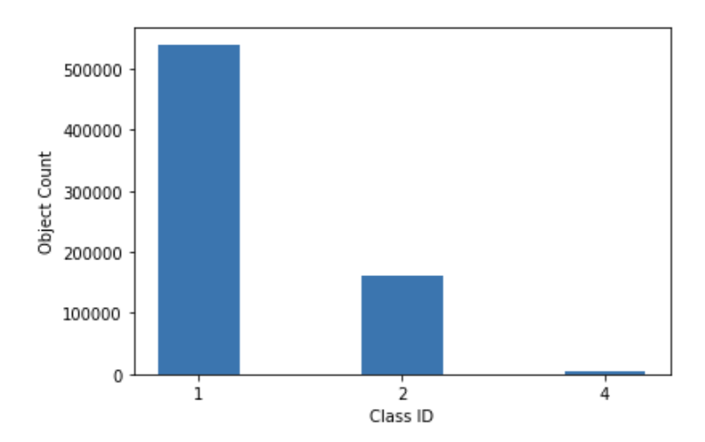
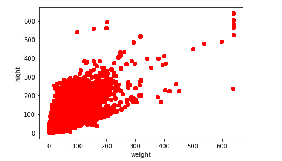
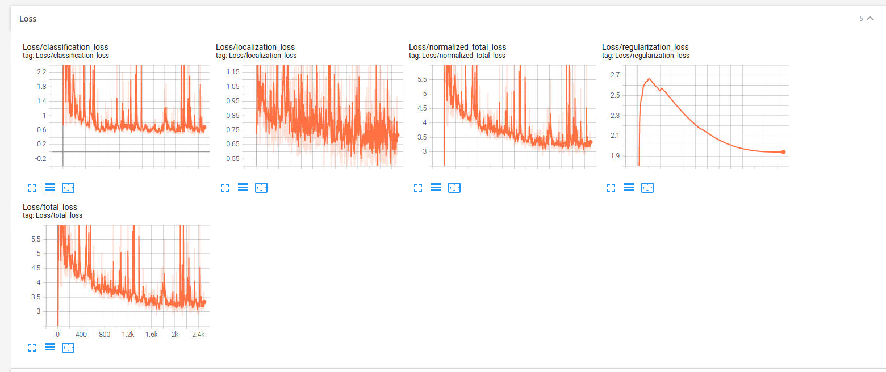
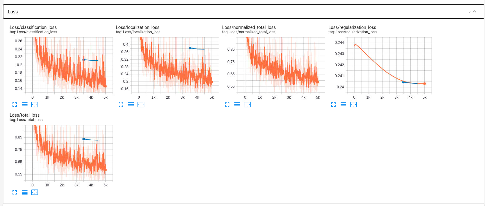

1. Overview  
   This project is about object detection in urban enviroment. In this project I want to detect all the project that affect the self-driving car such as car, bicycle, traffic sign, ... Detecting an object in the street is very crucial to the self-driving car. Because when a self-driving car run on the road, it has to know what obstacle is forward or which way it can go to or when it has to stop. For example, without object detection it will not know where the other car is and might hit other car
2. Setup  
   - To run this code first you need to install the python enviroment. You can you [miniconda](https://conda.io/miniconda.html).
   - Install the requirements file by running `pip install -r requirements.txt`.
   - To open the notebook, start the jupyter lab server by running `jupyter lab`
   - Download the [pretrained](http://download.tensorflow.org/models/object_detection/tf2/20200711/ssd_resnet50_v1_fpn_640x640_coco17_tpu-8.tar.gz) model and put it in the folder `/home/workspace/experiments/pretrained_model/`
   - Then create the new config file by running `python edit_config.py --train_dir /home/workspace/data/train/ --eval_dir /home/workspace/data/val/ --batch_size 2 --checkpoint /home/workspace/experiments/pretrained_model/ssd_resnet50_v1_fpn_640x640_coco17_tpu-8/checkpoint/ckpt-0 --label_map /home/workspace/experiments/label_map.pbtxt`
   - To start train the model, use the command `python experiments/model_main_tf2.py --model_dir=experiments/reference/ --pipeline_config_path=experiments/reference/pipeline_new.config`
   - For evaluate `python experiments/model_main_tf2.py --model_dir=experiments/reference/ --pipeline_config_path=experiments/reference/pipeline_new.config --checkpoint_dir=experiments/reference/`
3. Dataset  
   - Analysis:
     - The dataset is very unbalance with the class 1 have very many sample meanwhile class 4 is only have some. .
     - Size of the bbox in the dataset.   .
   - Data split:
     - I use the default train and valid set in the workspace
4. Training  
   - To training model first we need to create new config file using this command `python edit_config.py --train_dir /home/workspace/data/train/ --eval_dir /home/workspace/data/val/ --batch_size 2 --checkpoint /home/workspace/experiments/pretrained_model/ssd_resnet50_v1_fpn_640x640_coco17_tpu-8/checkpoint/ckpt-0 --label_map /home/workspace/experiments/label_map.pbtxt`
   - To start training `python experiments/model_main_tf2.py --model_dir=experiments/reference/ --pipeline_config_path=experiments/reference/pipeline_new.config`
   - To evaluation `python experiments/model_main_tf2.py --model_dir=experiments/reference/ --pipeline_config_path=experiments/reference/pipeline_new.config --checkpoint_dir=experiments/reference/`
   - First I trained the model using the default parameters in the config file and get the flowing result   
   - Loss after training   
     - The model is overfiting because lower training loss
   - Agumentation:
     - random_crop_image
     - random_adjust_brightness
     - random_adjust_contrast
     - random_adjust_hue
     - random_adjust_saturation
     - random_distort_color
   